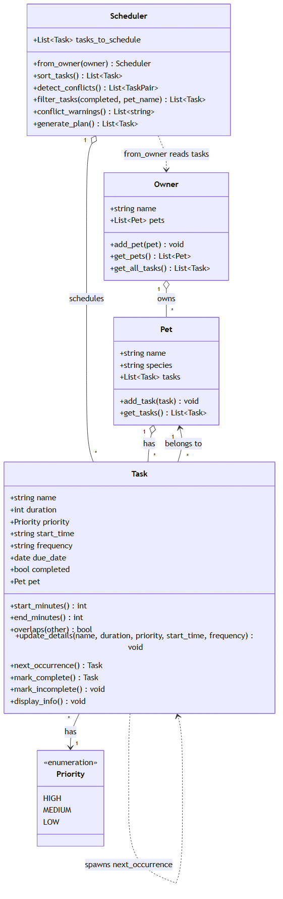

# PawPal+ (Module 2 Project)

You are building **PawPal+**, a Streamlit app that helps a pet owner plan care tasks for their pet.

## Scenario

A busy pet owner needs help staying consistent with pet care. They want an assistant that can:

- Track pet care tasks (walks, feeding, meds, enrichment, grooming, etc.)
- Consider constraints (time available, priority, owner preferences)
- Produce a daily plan and explain why it chose that plan

Your job is to design the system first (UML), then implement the logic in Python, then connect it to the Streamlit UI.

## ✨ Features

PawPal+ turns a flat list of pet-care tasks into a conflict-checked daily plan.
The scheduling algorithms all live in `pawpal_system.py`:

- **Sorting by time** — `Scheduler.sort_tasks()` orders the day by start time
  (computed as minutes since midnight, so `"9:30"` and `"09:30"` sort correctly),
  using task **priority** (HIGH → MEDIUM → LOW) only to break ties. Unscheduled
  tasks (no start time) always sort last.
- **Daily plan generation** — `Scheduler.generate_plan()` returns today's routine:
  the sorted task list with completed tasks dropped.
- **Next available slot** — `Scheduler.find_next_available_slot()` sweeps the day's
  booked intervals and returns the earliest free `HH:MM` start time that fits a
  task of a given duration (within a configurable working window), or `None` when
  the day is too full. It is date-aware and ignores completed/unscheduled tasks,
  just like conflict detection.
- **Conflict warnings** — `Scheduler.detect_conflicts()` finds every pair of
  pending, timed tasks whose ranges overlap — even across different pets, since
  the owner can't be in two places at once. It is **date-aware** (a task dated for
  tomorrow can't clash with one for today) and uses a sweep-line early-exit for
  efficiency. `conflict_warnings()` turns each conflict into a readable message.
- **Daily / weekly recurrence** — completing a recurring task with
  `Task.mark_complete()` auto-creates its next occurrence (`+1 day` for daily,
  `+1 week` for weekly) and attaches it to the same pet. `"once"`/`"monthly"`
  tasks don't auto-repeat.
- **Filtering** — `Scheduler.filter_tasks()` filters by completion status and/or
  pet name (case-insensitive); the two filters combine with AND.
- **Input validation** — tasks reject empty names and non-positive durations at
  construction time.
- **Persistence** — `Owner.save_to_json()` / `Owner.load_from_json()` save the
  whole owner/pet/task tree to a `data.json` file and reload it, so pets and tasks
  survive between runs. See [Persistence](#-persistence).

See [System Design (UML)](#-system-design-uml) for how these classes fit together
and [Smarter Scheduling](#-smarter-scheduling) for per-method detail.

## What you will build

Your final app should:

- Let a user enter basic owner + pet info
- Let a user add/edit tasks (duration + priority at minimum)
- Generate a daily schedule/plan based on constraints and priorities
- Display the plan clearly (and ideally explain the reasoning)
- Include tests for the most important scheduling behaviors

## Getting started

### Setup

```bash
python -m venv .venv
source .venv/bin/activate  # Windows: .venv\Scripts\activate
pip install -r requirements.txt
```

### Suggested workflow

1. Read the scenario carefully and identify requirements and edge cases.
2. Draft a UML diagram (classes, attributes, methods, relationships).
3. Convert UML into Python class stubs (no logic yet).
4. Implement scheduling logic in small increments.
5. Add tests to verify key behaviors.
6. Connect your logic to the Streamlit UI in `app.py`.
7. Refine UML so it matches what you actually built.

## 🖥️ Sample Output

See the [Demo Walkthrough](#-demo-walkthrough) below for full, up-to-date sample
output from `python main.py` (the sorted plan, filters, recurrence, and conflict
check).

## 🧪 Testing PawPal+

Run the full test suite from the project root:

```bash
python -m pytest
```

### What the tests cover

The suite (`tests/test_pawpal.py`) exercises the core scheduling and persistence logic:

- **Data objects** — adding a task to a pet increases its task count; `mark_complete()` flips a task's status.
- **Sorting correctness** — timed tasks come back in chronological order, ties are broken by priority (HIGH first), and unscheduled tasks sort last.
- **Recurrence logic** — completing a `daily` task spawns a pending copy dated one day later and auto-attaches it to the same pet, while a `once` task never repeats.
- **Conflict detection** — two pending tasks at the exact same time are flagged, back-to-back tasks that only touch at the boundary are not, and completed tasks are ignored.
- **Next available slot** — an empty day suggests the working-window start, a too-small gap is skipped for the next viable one, a full day returns `None`, and completed/unscheduled/other-day tasks are correctly ignored.
- **Persistence** — saving an owner and loading it back preserves its pets and tasks (including `Priority` enums and `due_date`s) via `tmp_path`, rebuilds the `Task.pet` back-reference that isn't serialized, and returns `None` when no save file exists yet.

### Sample test output

```
============================= test session starts =============================
platform win32 -- Python 3.13.7, pytest-9.1.1, pluggy-1.6.0
rootdir: C:\Users\Ire\Desktop\Codepath AI 110\ai110-module2show-pawpal-starter
plugins: anyio-4.14.1
collected 19 items

tests\test_pawpal.py ...................                                 [100%]

============================= 19 passed in 0.20s ==============================
```

### Confidence Level

⭐⭐⭐⭐☆ (4/5)

All 19 tests pass, covering the five highest-risk areas — sorting, recurrence, conflict detection, next-available-slot search, and JSON persistence (round-trip data integrity, back-reference rebuilding, and missing-file handling) — including their key edge cases (same-time conflicts, touching boundaries, `once` tasks, too-small gaps, full days, and date-aware slot finding). The fourth star reflects solid coverage of the critical paths; the fifth is held back because some behaviors are not yet tested: `filter_tasks()`, date-aware conflicts (today vs. tomorrow), cross-pet conflict warnings, undated recurring tasks, and input validation (empty names, non-positive durations).

## 📐 System Design (UML)

The class diagram below reflects the final implementation in `pawpal_system.py`.
Source: [`diagrams/uml_final.mmd`](diagrams/uml_final.mmd).



The PNG is generated from the Mermaid source. After editing `uml_final.mmd`,
re-export it with the [Mermaid CLI](https://github.com/mermaid-js/mermaid-cli)
(requires Node.js):

```bash
npx @mermaid-js/mermaid-cli -i diagrams/uml_final.mmd -o diagrams/uml_final.png -b white
```

## 📐 Smarter Scheduling

All scheduling logic lives in `pawpal_system.py`. Below is each feature we
implemented and the method that powers it.

| Feature | Method(s) | Notes |
|---------|-----------|-------|
| Task sorting | `Scheduler.sort_tasks()` | Orders the day by start time, with `Priority` as a tie-breaker; unscheduled tasks sort last. |
| Filtering | `Scheduler.filter_tasks()` | Filters by completion status and/or pet name (case-insensitive); the two filters combine with AND. |
| Conflict detection | `Scheduler.detect_conflicts()`, `Scheduler.conflict_warnings()`, `Task.overlaps()`, `_same_day()` | Finds overlapping timed tasks across any pets and returns either pairs or printable warnings. |
| Next available slot | `Scheduler.find_next_available_slot()` | Sweeps booked intervals to suggest the earliest free start time that fits a new task within the working window. |
| Recurring tasks | `Task.mark_complete()`, `Task.next_occurrence()` | Completing a daily/weekly task auto-creates its next occurrence on the next date. |

### Sorting behavior — `Scheduler.sort_tasks()`

Sorts the task list in place using a tuple key `(start_minutes is None,
start_minutes or 0, priority)`. This puts **timed tasks before unscheduled
ones**, orders timed tasks by clock time, and uses `Priority` (HIGH=0 first)
only to break ties. Sorting on minutes-since-midnight (via the `start_minutes`
property) rather than the raw `"HH:MM"` string keeps it correct even for
non-zero-padded times. `Scheduler.generate_plan()` calls this and then drops
completed tasks to produce today's routine.

Pass `by_priority=True` to either method for **priority-first** scheduling —
sort by `Priority` (HIGH → MEDIUM → LOW) first, with start time breaking ties
within a band. See [Challenge 3 - Priority-Based Scheduling](#-challenge-3---priority-based-scheduling).

### Filtering behavior — `Scheduler.filter_tasks()`

Returns the tasks matching optional filters:

- `completed` — `True` for done tasks, `False` for pending, `None` to ignore.
- `pet_name` — keep only one pet's tasks (case-insensitive, `None` for any pet).

Both are optional and combine with AND, so `filter_tasks()` returns everything,
`filter_tasks(pet_name="Rex")` returns just Rex's tasks, and
`filter_tasks(completed=False, pet_name="Bella")` returns Bella's pending tasks.

### Conflict detection — `Scheduler.detect_conflicts()` / `conflict_warnings()`

Because the owner can't be in two places at once, any two **pending, timed**
tasks whose ranges overlap — even across different pets — count as a conflict.
`Task.overlaps()` does the time-range math, and the `_same_day()` helper makes
detection date-aware so tomorrow's recurring task can't clash with today's.
`detect_conflicts()` returns the raw `(Task, Task)` pairs (sorted by start time,
with a sweep-line early exit), while `conflict_warnings()` is a lightweight
wrapper that turns each pair into a printable warning string and never raises.

### Next available slot — `Scheduler.find_next_available_slot()`

Given a task `duration` (and an optional working window, default `08:00`–`20:00`),
this sweeps the day's **pending, timed** tasks as booked intervals, sorts them,
and walks a cursor from `day_start`, returning the first gap large enough to hold
the new task as an `HH:MM` string — or `None` if nothing fits before `day_end`. It
clips bookings to the window, merges overlaps as it sweeps, and mirrors conflict
detection's rules: completed and unscheduled tasks never block a slot, and with an
`on_date` argument a task only blocks the day it's dated for (undated tasks float
to "any day"). This turns "when can I fit a 45-minute grooming session?" into a
one-call answer instead of eyeballing the schedule.

### Recurring task logic — `Task.mark_complete()` / `next_occurrence()`

Tasks carry a `frequency` (`"daily"`, `"weekly"`, etc.) and an optional
`due_date`. When a recurring task is completed, `mark_complete()` calls
`next_occurrence()`, which uses `datetime.timedelta` to compute the next date
(`+1 day` for daily, `+1 week` for weekly) and returns a fresh, pending copy
that is automatically attached to the same pet. `"once"`/`"monthly"` tasks don't
auto-repeat (`timedelta` has no calendar-month unit).


## 📸 Demo Walkthrough

PawPal+ has two front ends over the same scheduling engine: a **Streamlit UI**
(`app.py`) for interactive use and a **CLI script** (`main.py`) that exercises
every feature end to end.

### Main UI features (Streamlit)

Run `streamlit run app.py`. The app lets a user:

- **Add an owner and pets** — enter the owner's name, then add pets by name and
  species (`Owner.add_pet` / `Pet`).
- **Add tasks to a pet** — give each task a title, duration, priority, start time,
  and the pet it belongs to (`Pet.add_task`).
- **Find the next free slot** — ask PawPal+ for the earliest open start time that
  fits a task of the chosen duration (`Scheduler.find_next_available_slot`).
- **Browse and filter tasks** — the task table is sorted into the day's order, with
  dropdowns to filter by pet and by status (All / Pending / Done) via
  `Scheduler.filter_tasks()`.
- **Complete tasks** — mark a task done; if it's daily/weekly, the next occurrence
  is created automatically and the app reports its date (`Task.mark_complete()`).
- **Generate the daily schedule** — produce a sorted plan and a conflict report.

### Example workflow

1. Enter the owner's name (e.g. *Ada*).
2. **Add a pet** → *Rex (dog)*; add a second → *Bella (cat)*.
3. **Schedule tasks** → e.g. *Morning walk* for Rex at 08:00 (high priority,
   daily), *Feed* for Bella at 08:15, and a couple of 14:00 tasks.
4. Click **Generate schedule** → PawPal+ shows **Today's Schedule** sorted by time.
5. Read the **conflict report** — overlapping tasks are flagged with a suggestion.
6. Back in the task list, **mark *Morning walk* complete** → its next-day
   occurrence appears automatically.

### Key Scheduler behaviors shown

- **Sorting by time** — tasks entered out of order come back in chronological
  order, with priority breaking ties at the same time.
- **Completion filtering** — a pre-completed task is hidden from "Today's Schedule"
  but still visible under the "Done" filter.
- **Conflict warnings** — same-time tasks across different pets are flagged (the
  owner can't be in two places at once).
- **Daily recurrence** — completing the daily walk auto-creates tomorrow's copy.

### Sample CLI output (`python main.py`)

The CLI runs the full scenario above and prints each stage:

```
--- Tasks as entered (out of order) ---
[ ] 14:00 on 2026-06-28 Vet visit (for Rex) (60 min) [priority: low]
[ ] 08:00 on 2026-06-28 Morning walk (for Rex) (30 min) [priority: high]
[ ] 14:00 on 2026-06-28 Play fetch (for Rex) (20 min) [priority: medium]
[x] 07:30 on 2026-06-28 Refill water (for Rex) (5 min) [priority: high]
[ ] 18:00 on 2026-06-28 Brush coat (for Bella) (15 min) [priority: medium]
[ ] 08:15 on 2026-06-28 Feed (for Bella) (10 min) [priority: medium]
[ ] 14:00 on 2026-06-28 Litter change (for Bella) (10 min) [priority: high]

=== Today's Schedule for Ada ===
[ ] 08:00 on 2026-06-28 Morning walk (for Rex) (30 min) [priority: high]
[ ] 08:15 on 2026-06-28 Feed (for Bella) (10 min) [priority: medium]
[ ] 14:00 on 2026-06-28 Litter change (for Bella) (10 min) [priority: high]
[ ] 14:00 on 2026-06-28 Play fetch (for Rex) (20 min) [priority: medium]
[ ] 14:00 on 2026-06-28 Vet visit (for Rex) (60 min) [priority: low]
[ ] 18:00 on 2026-06-28 Brush coat (for Bella) (15 min) [priority: medium]

=== Priority-First Schedule for Ada ===
[ ] 08:00 on 2026-06-28 Morning walk (for Rex) (30 min) [priority: high]
[ ] 14:00 on 2026-06-28 Litter change (for Bella) (10 min) [priority: high]
[ ] 08:15 on 2026-06-28 Feed (for Bella) (10 min) [priority: medium]
[ ] 14:00 on 2026-06-28 Play fetch (for Rex) (20 min) [priority: medium]
[ ] 18:00 on 2026-06-28 Brush coat (for Bella) (15 min) [priority: medium]
[ ] 14:00 on 2026-06-28 Vet visit (for Rex) (60 min) [priority: low]

--- Filter: only Rex's tasks ---
[x] 07:30 on 2026-06-28 Refill water (for Rex) (5 min) [priority: high]
[ ] 08:00 on 2026-06-28 Morning walk (for Rex) (30 min) [priority: high]
[ ] 14:00 on 2026-06-28 Play fetch (for Rex) (20 min) [priority: medium]
[ ] 14:00 on 2026-06-28 Vet visit (for Rex) (60 min) [priority: low]

--- Filter: completed tasks ---
[x] 07:30 on 2026-06-28 Refill water (for Rex) (5 min) [priority: high]

--- Filter: pending tasks ---
[ ] 08:00 on 2026-06-28 Morning walk (for Rex) (30 min) [priority: high]
[ ] 14:00 on 2026-06-28 Litter change (for Bella) (10 min) [priority: high]
[ ] 08:15 on 2026-06-28 Feed (for Bella) (10 min) [priority: medium]
[ ] 14:00 on 2026-06-28 Play fetch (for Rex) (20 min) [priority: medium]
[ ] 18:00 on 2026-06-28 Brush coat (for Bella) (15 min) [priority: medium]
[ ] 14:00 on 2026-06-28 Vet visit (for Rex) (60 min) [priority: low]

--- Completing 'Morning walk' (daily) ---
Auto-created next occurrence due: 2026-06-29
Rex's tasks now (note the new pending walk for tomorrow):
[x] 07:30 on 2026-06-28 Refill water (for Rex) (5 min) [priority: high]
[x] 08:00 on 2026-06-28 Morning walk (for Rex) (30 min) [priority: high]
[ ] 08:00 on 2026-06-29 Morning walk (for Rex) (30 min) [priority: high]
[ ] 14:00 on 2026-06-28 Play fetch (for Rex) (20 min) [priority: medium]
[ ] 14:00 on 2026-06-28 Vet visit (for Rex) (60 min) [priority: low]

--- Conflict check ---
WARNING - conflict for Bella and Rex: 'Litter change' (14:00) overlaps 'Play fetch' (14:00).
WARNING - conflict for Bella and Rex: 'Litter change' (14:00) overlaps 'Vet visit' (14:00).
WARNING - conflict for Rex's schedule: 'Play fetch' (14:00) overlaps 'Vet visit' (14:00).

--- Next available slot ---
Earliest free 45-min slot today: 08:25
```

**Screenshot or video** *(optional)*: <!-- Insert a screenshot or link to a demo video here -->


### Stretch features

### 💾 Challenge 2 - Persistence

PawPal+ remembers your pets and tasks between runs by saving them to a
`data.json` file in the project root. Close the Streamlit app and reopen it — your
owner, pets, and tasks are still there.

### How it works

Persistence is handled entirely in the logic layer (`pawpal_system.py`) using
**custom dictionary conversion** plus Python's standard-library `json` module — no
extra dependencies. Each data class knows how to flatten itself to a plain dict
and rebuild itself from one:

| Method | Class | Role |
|--------|-------|------|
| `to_dict()` / `from_dict()` | `Task`, `Pet`, `Owner` | Convert each object to/from a JSON-safe dict; nesting mirrors the `Owner → Pet → Task` tree. |
| `Owner.save_to_json(path="data.json")` | `Owner` | Serialize the whole tree and write it as pretty-printed JSON. |
| `Owner.load_from_json(path="data.json")` | `Owner` | Read the file and rebuild the tree; returns `None` on a clean first run (no file yet). |

### Why custom conversion (not marshmallow)?

Three fields don't serialize to JSON cleanly, and each has a one-line fix —
small enough that a full schema library like **marshmallow** would be overkill
here (it also means **zero new dependencies**):

- **`Priority` (an `IntEnum`)** → stored as its int value, restored with
  `Priority(value)`.
- **`due_date` (a `date`)** → stored as an ISO `"YYYY-MM-DD"` string, restored
  with `date.fromisoformat()`.
- **`Task.pet` back-reference** → **deliberately not serialized.** Writing it
  would recurse forever (`pet → tasks → task → pet → …`). Instead it's omitted on
  save and rebuilt on load: `Pet.from_dict()` routes every task through
  `Pet.add_task()`, which re-sets each task's `pet`.

> **When marshmallow *would* pay off:** many schemas, declarative
> validation/versioned migration, or exposing the data over an API. For this
> three-class tree, explicit `to_dict`/`from_dict` is simpler and easier to test.

### Persistence workflow

1. **Startup** — `app.py` calls `Owner.load_from_json()`. If `data.json` exists,
   the previous session is restored; otherwise a fresh `Owner` is created.
2. **On every change** — adding a pet, adding a task, marking a task complete, or
   renaming the owner calls a small `save_owner()` helper, which writes the
   current state back to `data.json`.
3. **Next run** — the app loads that file again, so nothing is lost.

The CLI logic layer is UI-agnostic, so the same two methods work from any front
end or a script: `owner.save_to_json()` / `Owner.load_from_json()`.

### Files modified for persistence

- **`pawpal_system.py`** — added `to_dict()`/`from_dict()` to `Task`, `Pet`, and
  `Owner`, plus `Owner.save_to_json()` / `Owner.load_from_json()` and a
  `DEFAULT_DATA_PATH` constant (and the stdlib `json` import).
- **`app.py`** — load the owner from `data.json` on startup and save after each
  mutation via a `save_owner()` helper.
- **`tests/test_pawpal.py`** — added round-trip tests (data preserved, `Task.pet`
  back-reference rebuilt, missing file returns `None`).
- **`.gitignore`** — ignore the generated `data.json` (it's per-user runtime data,
  not source).

## 🎯 Challenge 3 - Priority-Based Scheduling

PawPal+ goes beyond simple time sorting with an optional **priority-first** plan.
Every `Task` already carries a `Priority` (`LOW` / `MEDIUM` / `HIGH`); this
feature lets the scheduler order the day by *importance* first and clock time
only second, so the things that matter most float to the top of the list.

### How it works

`Scheduler.sort_tasks()` and `Scheduler.generate_plan()` take a `by_priority`
flag (default `False`, which preserves the original time-first behavior):

| Mode | Sort key | Behavior |
|------|----------|----------|
| Time-first (default) | `(unscheduled?, start_time, priority)` | Order by clock time; priority only breaks ties between tasks at the same time. |
| Priority-first (`by_priority=True`) | `(priority, unscheduled?, start_time)` | Order by `Priority` (HIGH → MEDIUM → LOW); start time only breaks ties *within* a priority band. |

`Priority` is an `IntEnum` with `HIGH = 0`, so it sorts ascending into
HIGH → MEDIUM → LOW with no extra bookkeeping. Unscheduled tasks (no start time)
still sort after timed ones in both modes.

```python
scheduler = Scheduler.from_owner(owner)
scheduler.generate_plan()                 # time-first (default)
scheduler.generate_plan(by_priority=True) # priority-first
```

### Challenge 3 - CLI output

Running `python main.py` prints the **same pending tasks** under both
strategies, back to back. Watch the 14:00 high-priority *Litter change* leap
ahead of the 08:15 medium *Feed* once priority drives the sort:

```
=== Today's Schedule for Ada ===
[ ] 08:00 on 2026-06-28 Morning walk (for Rex) (30 min) [priority: high]
[ ] 08:15 on 2026-06-28 Feed (for Bella) (10 min) [priority: medium]
[ ] 14:00 on 2026-06-28 Litter change (for Bella) (10 min) [priority: high]
[ ] 14:00 on 2026-06-28 Play fetch (for Rex) (20 min) [priority: medium]
[ ] 14:00 on 2026-06-28 Vet visit (for Rex) (60 min) [priority: low]
[ ] 18:00 on 2026-06-28 Brush coat (for Bella) (15 min) [priority: medium]

=== Priority-First Schedule for Ada ===
[ ] 08:00 on 2026-06-28 Morning walk (for Rex) (30 min) [priority: high]
[ ] 14:00 on 2026-06-28 Litter change (for Bella) (10 min) [priority: high]
[ ] 08:15 on 2026-06-28 Feed (for Bella) (10 min) [priority: medium]
[ ] 14:00 on 2026-06-28 Play fetch (for Rex) (20 min) [priority: medium]
[ ] 18:00 on 2026-06-28 Brush coat (for Bella) (15 min) [priority: medium]
[ ] 14:00 on 2026-06-28 Vet visit (for Rex) (60 min) [priority: low]
```

Reading the priority-first plan: both `high` tasks come first (ordered 08:00
then 14:00 by time), then the three `medium` tasks (08:15 → 14:00 → 18:00), and
finally the single `low` task — even though that low-priority *Vet visit* starts
at 14:00, well before the 18:00 *Brush coat*.

### Files modified for priority-based scheduling

- **`pawpal_system.py`** — added the `by_priority` flag to `Scheduler.sort_tasks()`
  and `Scheduler.generate_plan()` (the `Priority` enum and `Task.priority` field
  already existed).
- **`main.py`** — print a `Priority-First Schedule` block alongside the default
  time-first one so the contrast is visible in the CLI.

## 🎨 Challenge 4 - Friendly CLI Output

PawPal+'s CLI no longer prints flat, monochrome lines. The schedule now comes
back as a **bordered table**, every task carries a **type emoji**, and priority
and completion status are **color-coded** so the most important (and overdue)
items jump out at a glance.

All of this lives in a dedicated **view layer**, `formatting.py`, so the logic
layer (`pawpal_system.py`) stays styling-free. `main.py` just calls two helpers
to render.

### What we added

| Feature | Where | Detail |
|---------|-------|--------|
| **Task-type emojis** | `formatting.task_emoji()` | Scans a task's name for keywords and picks an emoji — 🐕 walk, 🍽️ feed, 💧 water, 💊 vet/meds, 🛁 groom/brush, 🎾 play/fetch, 🧹 litter, 😴 rest, 📋 default. |
| **Color-coded priority** | `formatting.priority_label()` | `Priority` → colored badge: 🔴 **high** (red), 🟡 **medium** (yellow), 🟢 **low** (green). |
| **Status indicators** | `formatting.status_icon()` | ✅ green `done` for completed tasks, ⏳ dim `todo` for pending. |
| **Structured tables** | `formatting.tasks_table()` | Renders a list of tasks as a grid (Status / Time / Task / Pet / Duration / Priority). |
| **One-line view** | `formatting.format_task_line()` | A compact, colored, emoji'd single line — a drop-in replacement for the old `Task.display_info()`, used for the filter listings. |

### Libraries & functions used

- **[`tabulate`](https://pypi.org/project/tabulate/)** (new dependency, added to
  `requirements.txt`) — draws the bordered schedule grid via
  `tabulate(rows, headers=..., tablefmt="rounded_grid")`. It's an **optional**
  import: if it isn't installed, `tasks_table()` falls back to a hand-aligned
  `_fallback_table()` so the CLI still runs with zero extra dependencies.
- **ANSI escape codes (stdlib only)** — `_paint()` wraps text in color/bold/dim
  codes. Colors are emitted **only when safe**: `_color_enabled()` checks
  `sys.stdout.isatty()` and honors the `NO_COLOR` convention, so piped or
  redirected output stays clean and parseable.
- **Windows support (stdlib `os` / `sys`)** — on Windows we call `os.system("")`
  to enable virtual-terminal (ANSI) processing and
  `sys.stdout.reconfigure(encoding="utf-8")` so the emojis don't choke the
  default `cp1252` console.

### Sample CLI output (`python main.py`)

The schedule now prints as a grid (priority/status colors show in a real
terminal; they're stripped here because output is being captured):

```
📅 === Today's Schedule for Ada ===
╭──────────┬────────────┬─────────────────┬───────┬────────────┬────────────╮
│ Status   │ Time       │ Task            │ Pet   │ Duration   │ Priority   │
├──────────┼────────────┼─────────────────┼───────┼────────────┼────────────┤
│ ⏳ todo   │ 08:00      │ 🐕 Morning walk  │ Rex   │ 30 min     │ 🔴 high     │
│          │ 2026-06-28 │                 │       │            │            │
├──────────┼────────────┼─────────────────┼───────┼────────────┼────────────┤
│ ⏳ todo   │ 08:15      │ 🍽️ Feed         │ Bella │ 10 min     │ 🟡 medium   │
│          │ 2026-06-28 │                 │       │            │            │
├──────────┼────────────┼─────────────────┼───────┼────────────┼────────────┤
│ ⏳ todo   │ 14:00      │ 🧹 Litter change │ Bella │ 10 min     │ 🔴 high     │
│          │ 2026-06-28 │                 │       │            │            │
╰──────────┴────────────┴─────────────────┴───────┴────────────┴────────────╯
```

The filter listings use the one-line view instead:

```
🔎 --- Filter: only Rex's tasks ---
✅ done  07:30  💧 Refill water (5 min) for Rex on 2026-06-28  🔴 high
⏳ todo  08:00  🐕 Morning walk (30 min) for Rex on 2026-06-28  🔴 high
⏳ todo  14:00  🎾 Play fetch (20 min) for Rex on 2026-06-28  🟡 medium
⏳ todo  14:00  💊 Vet visit (60 min) for Rex on 2026-06-28  🟢 low
```

### Files modified for friendly output

- **`formatting.py`** (new) — the view layer: `task_emoji()`, `status_icon()`,
  `priority_label()`, `format_task_line()`, `tasks_table()`, the `_paint()` /
  `_color_enabled()` ANSI helpers, and the `tabulate` import with its
  `_fallback_table()` safety net.
- **`main.py`** — render the schedules with `tasks_table()` and the filter
  listings with `format_task_line()` (replacing the old `Task.display_info()`
  calls), plus section-header emojis (📅 schedule, ⭐ priority, 🔎 filter,
  ⚠️ conflicts, 🕒 slot).
- **`requirements.txt`** — added `tabulate>=0.9`.